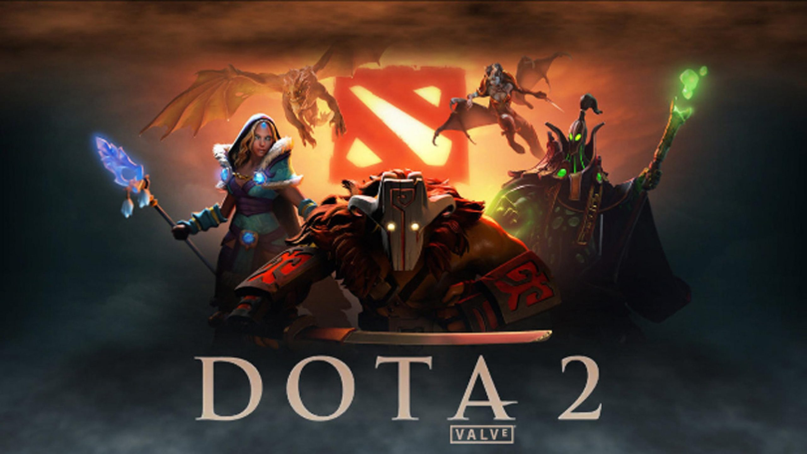

<h1>Dota 2 Machine (D2M)</h1>

<h2>What is D2M?</h2>

D2M is basically a vending machine that sells Dota 2 Figurine to its customers and containing a management system for the items and admins within the Vending Machine ecosystem. 
   
Functions that are implemented in the vending machine included:

  <ul>
    <li>Adding, Updating, Deleting Item Data</li>
    <li>Adding, Updating, Deleting Admin Data</li>
    <li>Basic Payment System (Calculating Total & Change)</li>
    <li>Random Item ID Generator</li>
    <li>Admin Login System</li>
  </ul>
  It is also worth noting that all data are saved in the form of a txt files as it is of per requisite of the assignment's criteria.

<h2>How Was D2M Developed?</h2>

The D2M was fully developed using Java Programming Language in Netbeans IDE with Java SE 8.

<h2>Reason for Development of D2M</h2>

The D2M was developed to fufill the criteria of the Java Module Assignment in my Diploma in Software Engineering course.

<h2>Conclusion</h2>

In a nutshell, it has been a fun project to be doing as it reminded me a lot of the other project Cafe Management System which 
   I have done during my second semester for Visual Basic (VB). Also, it is satisfying to be able to code a fully-fledged vending 
   machine that is now functioning.
 

